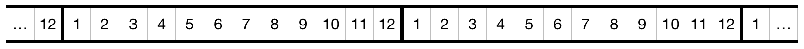
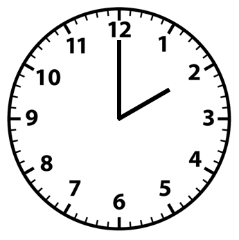

# Modular Arithmetic

In 1801, [Karl Friedrich Gauss](https://en.wikipedia.org/wiki/Carl_Friedrich_Gauss) “laid the foundation for modern number theory” in his work _Disquisitiones Arithmeticae_  \[7\]. In it, among other things, he presented formal methods for _modular arithmetic_ and introduced the concept of a _congruence relation_. These ideas, it turns out, are very useful in cryptography, we’ll look at them now.

### An Intuition 

Chances are you’re already well versed in modular arithmetic—even if you’ve never heard the term. Sometimes called “clock math”, modular arithmetic is the same as “regular” arithmetic, only it uses a number line made of a repeating interval instead of one whose numbers grow infinitely in magnitude. Some like to think of it as a number line which "wraps around". Consider the following number line…



Instead of starting at $$1$$ and increasing toward  $$\infty $$ , this number line starts at $$1$$ , increases to $$12$$ , and then goes back to $$1$$ . If we wanted to display it on a wall so that everyone could use it to count, in the interest of saving space, we might only display one interval of $$12$$ and wrap it around a circle like so:



Look familiar? As we know, a day contains $$24$$ hours. Why then, after counting $$12$$ hours do we go back to $$1$$ ? The answer of course, is that we use modular arithmetic! Let’s look at an example to make sure we really understand the “arithmetic” part.

Imagine you're at an amusement park with a group of friends. After some discussion, it’s decided that half the group wants to ride roller coasters and half wants to play games. The obvious thing to do is to split into two groups and meet at a later time. It’s **11:00AM** and the groups agree to meet in $$3$$ hours. Well, $$11+3=14$$, so the groups will meet at "fourteen o’clock”, right? Not unless they’re using military time, we all know they’ll meet at **2:00PM**.

In this example, $$12$$ is called the _modulus,_ which means, it’s the number after which counting to, we wrap around and continue counting from $$1$$ . The way to denote a modulus mathematically is$$\pmod n$$where $$n$$ is the modulus \(in this case $$12$$\). Putting it all together, we can express the meeting time of the two groups with the following equation:

$$
(11+3) \equiv 2  \pmod {12}
$$

The way to read this aloud is: "$$11 + 3$$ is congruent to $$2 \pmod{12}$$", or if we simplify, "$$14$$ is congruent to $$2 \pmod{12}$$". The triple bar $$\equiv$$ is called the _congruence symbol_ and the whole equation is called a _congruence realation_. In Java code we could express the same thing as follows:

```java
System.out.println(14 % 12 == 2); // Outputs true
```


Notice the difference in arrangement between the Java syntax and the math syntax. Don't let this trip you up like it did me, they're the same! 


Do you see the relationship between modular arithmetic and division? When I first learned division in elementary school \(before those tricky fractions\) I learned that $$14$$ divided by $$12$$ is $$1$$ with a remainder of $$2$$ . That’s essentially what we’re doing here—finding the remainder—and in fact some refer to this operation as “remainder division”. 


_Modular_, _modulo_, _modulus_, _moduli_, and _mod_ are all words that refer to  the same mathematical process; which word is used depends on the grammatical context. 


Hopefully you now have a good intution for modular arithmatic. Now we'll look at some fromal definitons and explicit examples.

### Congruence Modulo n

#### Definition

Let $$a,b\in \mathbb{Z}$$ and let $$n \in \mathbb{N}$$. $$a$$ is said to be **congruent** to $$b$$ **modulo** $$n$$ if $$n \mid (a-b)$$. 

#### In English

If $$a$$ and $$b$$ are integers and $$n$$ is a natural number, $$a$$ is congruent to $$b$$ modulo $$n$$ if $$n$$ evenly divides \($$a$$ minus $$b$$\)

#### Syntax

$$a \equiv b \pmod{n}$$ 

#### Examples

* $$27 \equiv 6 \pmod{7}$$ because $$7 \mid (27-6)$$
* $$53 \not\equiv 9 \pmod{5}$$ because $$5 \nmid (53 - 9)$$ 

#### Congruence as an Equivalence Relation

Because congruence modulo $$n$$ meets the following three properties, it is considered to be an _equivalance relation._

1. **Reflexive Property:** For all $$a \in \mathbb{Z},\: a \equiv a \pmod{n}$$.
2. **Symmetric Property:** For all $$a,b \in \mathbb{Z},$$ if $$a \equiv b \pmod{n}$$ then $$b \equiv a \pmod{n}$$.
3. **Transitive Property:** For all $$a,b,c \in \mathbb{Z},$$ if $$a \equiv b \pmod{n}$$ and $$b \equiv c \pmod{n}$$ then $$a \equiv c \pmod{n}$$ 


