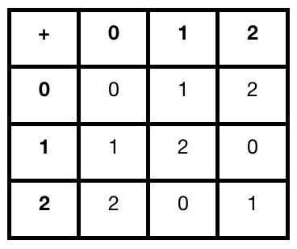

# Quadratic Residues

Generally speaking, a _quadratic residue_ is any integer $$a$$ that fulfills the equation $$x^2 \equiv a \pmod{n}$$. If $$a$$ doesn't fullfill the equation, it's called a _quadratic nonresidue_. To understand precisely what this means, we'll first look at _modular number systems_ and then we'll step through some explicit examples. 

### Modular Number Systems

A modular number system, denoted as $$\mathbb{Z}_{n}$$, is the set of integers ranging from $$0$$ to $$n-1$$ along with the operations _addition_ and _multiplication modulo_ $$n$$. Addition and multiplcation modulo $$n$$ is the addition or multiplcation of all elements contained in the set, modulo $$n$$. In other words, the _remainder_ or _residue_ of the arithmatic operation, mod $$n$$. 

#### **For Example:** $$\mathbb{Z}_{3} = \left \{0,\:1,\:2 \right \} $$

#### Addition modulo $$3$$ 

* $$0+0\equiv 0  \pmod{3}$$ 
* $$0+1\equiv 1  \pmod{3}$$ 

Continuing the pattern we could produce the following table

#### Multiplication modulo $$3$$ 

