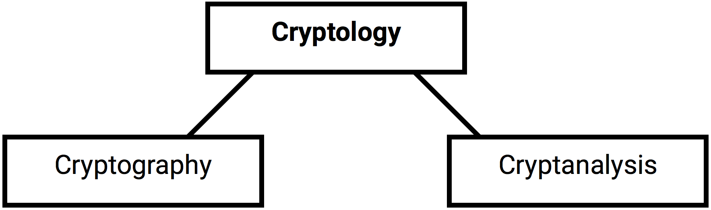
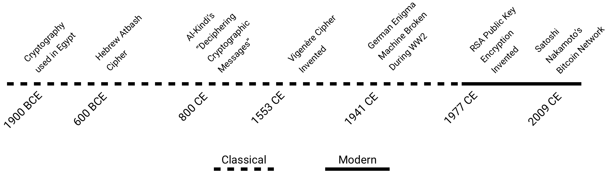

# Introduction

## What is Cryptography?

Cryptography is one of the two branches of the broader field of _cryptology_, the other branch being _cryptanalysis_.

Cryptography is the art and science of converting meaningful information called _plaintext_ into meaningless nonsense called _ciphertext_, and back again. The goal is to ensure that the plaintext can only be recovered from the ciphertext by those who hold the key.

Cryptanalysis, on the other hand, is the art and science of _breaking_ or _cracking_ ciphertext to reveal the hidden plaintext. A famous example of this occurred during World War II at Bletchley Park, England, where a team of scientists, including [Alan Turing](https://en.wikipedia.org/wiki/Alan_Turing), successfully deciphered the encrypted communications of the German army. The event is often credited with shortening the duration of the war, saving millions of lives, and ensuring an Allied victory.

As you can imagine, cryptography and cryptanalysis are closely related and inform each other. However, this tutorial primarily deals with cryptography and whether it’s robust against cryptanalysis.

## A Brief History

Cryptography’s earliest known usage reaches almost as far back as history itself to the time of Ancient Egypt approximately 4000 years ago \[1\]. From then to now, the history of cryptography is typically divided into two periods: _classical_ and _modern_.

### Classical Cryptography

Classical cryptography primarily used various plaintext _transposition_ and _substitution_ ciphers which \(as the names imply\) are methods of transposing or substituting plaintext characters with other plaintext characters according to predefined rules \(algorithms\). The security of these schemes depended on the algorithm remaining secret. Many classical ciphers can be broken by manual cryptanalysis; today's computers further lay waste to them. One exception of a classical cipher that hasn't been broken and theoretically _cannot_ be broken, is the _one-time pad_ \[2\]. It makes use of a critical component of modern cryptography: _randomness_—more on this to come_._

### Modern Cryptography

As much as cryptography was a catalyst for the development of modern computers \[3\], modern computers have been a catalyst for the development of a superior form of cryptography. In other words, the two are intrinsically linked; computers can make strong ciphers, and break strong ciphers. It therefore became necessary to think about the design and vulnerability of _cryptosystems_ in the context of modern computing. Up until the early 1970s, this was almost solely the domain of governmental intelligence agencies; any advancements in cryptography were kept secret by organizations like the NSA. In [Bruce Schneier](https://www.schneier.com/)’s classic book, _Applied Cryptography_ \[4\], [Whitfield Diffie](https://en.wikipedia.org/wiki/Whitfield_Diffie), a pioneer of _public-key cryptography_, recounts writing his seminal 1976 paper _New Directions in Cryptography_ :

> I had written the paper I had wanted to study, but could not find, when I first became seriously interested in cryptography. Had I been able to go to the Stanford bookstore and pick up a modern cryptography text, I would probably have learned about the field years earlier. But the only things available in the fall of 1972 were a few classic papers and some obscure technical reports.

It was this paper \[5\], which Diffie co-authored with [Martin Hellman](https://en.wikipedia.org/wiki/Martin_Hellman), that marked the beginning of the modern era of cryptography; an era in which powerful encryption was now available to the public. Cryptography quickly, though contentiously \[6\], became a thriving academic discipline, subject to formal standards and rigorous proofs.

## Why is Cryptography Important?

It’s difficult to fully grasp the significance of cryptography as we swiftly move into the digital age. We understand that it’s valuable because it secures the protocols and infrastructure we depend on daily: _banking, transportation, communication, etc_. We also understand that it’s controversial because it brings to the forefront the debate on privacy and government oversight. While these applications and issues are certainly important, they only highlight the most obvious, “first generational” uses of cryptography. 

Within the last decade, we’ve seen an explosion of new and creative ways to harness the mathematical impenetrability of cryptography. Legacy protocols for things like _money_ and _democracy_, are being redesigned and infused with cryptography by projects like [Bitcoin](https://en.wikipedia.org/wiki/Bitcoin) and [Democracy Earth](https://www.democracy.earth/). The idea is, by incorporating a layer of crypto \(along with [distributed consensus](https://en.wikipedia.org/wiki/Consensus_%28computer_science%29)\), protocols can be secured against manipulation by [centralized](https://en.wikipedia.org/wiki/Centralisation) powers and the rules of the protocol can be “locked up” ensuring fair play by all. An extension of this idea is [smart contracts](https://en.wikipedia.org/wiki/Smart_contract) which, for example, could enable a network of self-employed, fully-autonomous robots to deliver goods and services to humans \(or each other\) at the lowest possible operating cost with no corporate owners reaping profits and absolutely no middlemen—just mathematically guaranteed-to-execute computer programs.

In summary, cryptography is a fascinating and highly applicable fusion of mathematics and computer science; how exactly it will be used in the future remains to be seen. A few things are certain: cryptography will remain a critcal part of the information systems to come, and it’s never been a more exciting time to study and practice the art and science of cryptography.

